
<h1 align="center">基于WEB技术的在线商品交易平台的设计+vue</h1>

## 简介
在线商品交易平台：角色分为管理员和用户；公告浏览、商品浏览与管理、购物车与订单管理、用户账户管理、登录注册功能；SSM和Vue技术构建，提供高效用户交互。    --计算机毕业设计源码；毕设源码；java毕业设计源码

## 联系方式

<h3 align="center">获取完整代码与数据库文件 + 微信：deepguan QQ: 86050149 QQ群: 783742310</h3>

<h3 align="center">可帮忙远程部署 包运行成功！提供远程部署、修改代码、设计文档指导、代码讲解等服务！</h3>

## 功能介绍（完整见运行截图）
管理员：登录界面提供身份验证功能，后台管理界面包含商品类型管理、公告管理、商品管理、用户管理及商品评价管理模块，可进行商品信息修改、订单管理、商品上下架及库存调整等操作，支持订单发货操作并能查看、回复和删除商品评价，确保平台的正常运行和客户满意。

用户：用户界面提供登录注册功能，包含商品浏览和详细信息查看、公告查看、购物车管理、订单确认与提交、收货地址添加和余额充值等功能，支持查看订单详情和申请退款，个人中心方便用户管理个人信息、查询订单状态及修改地址，导航栏便捷访问系统各功能模块，实现快速购物和订单管理。

## 运行截图
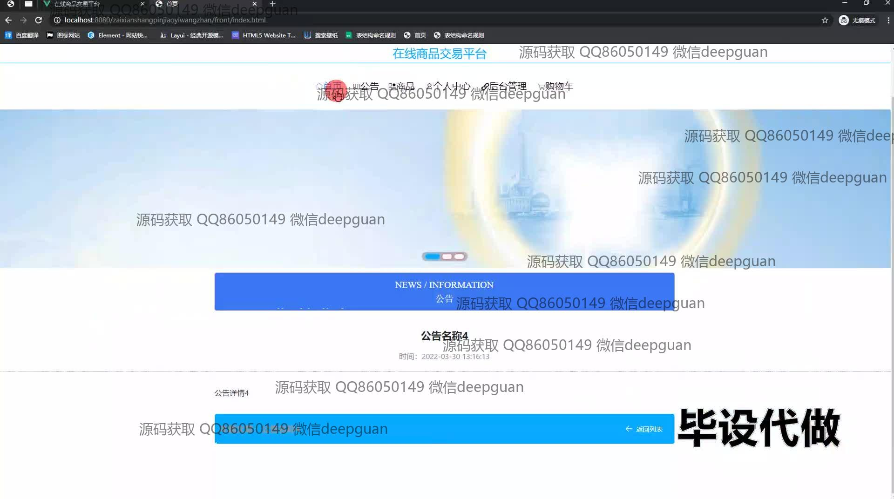
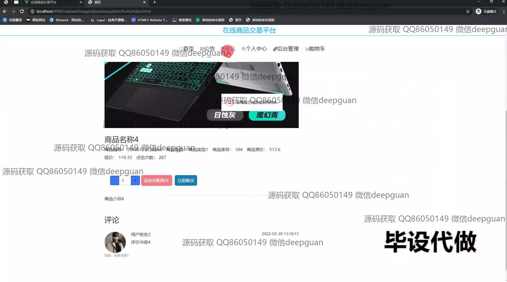
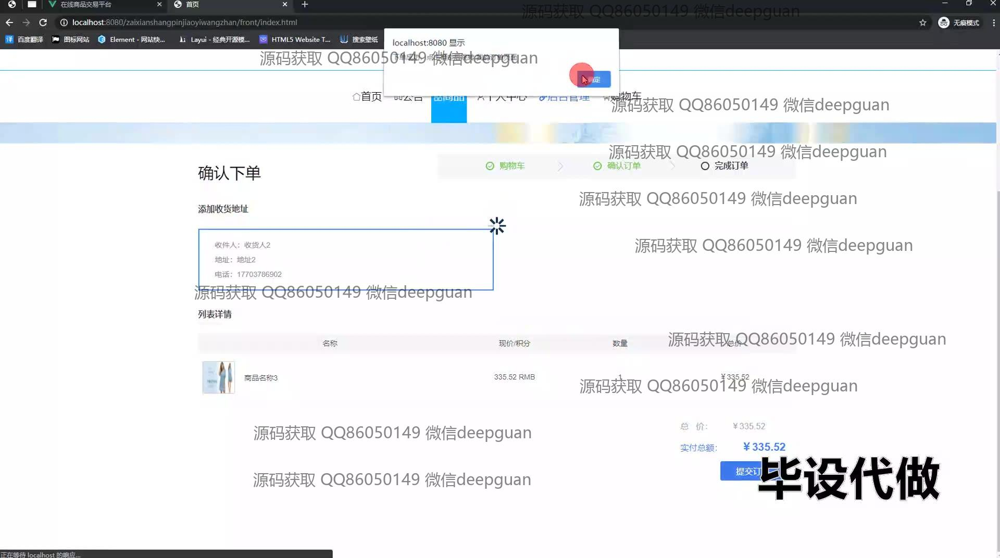
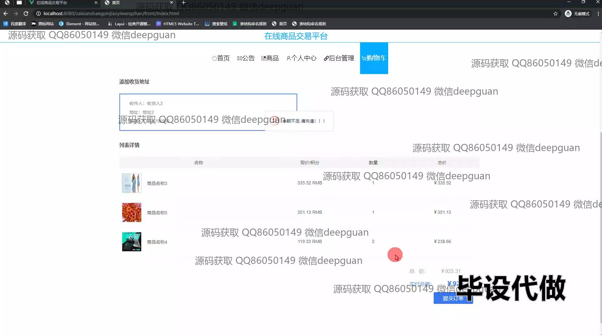
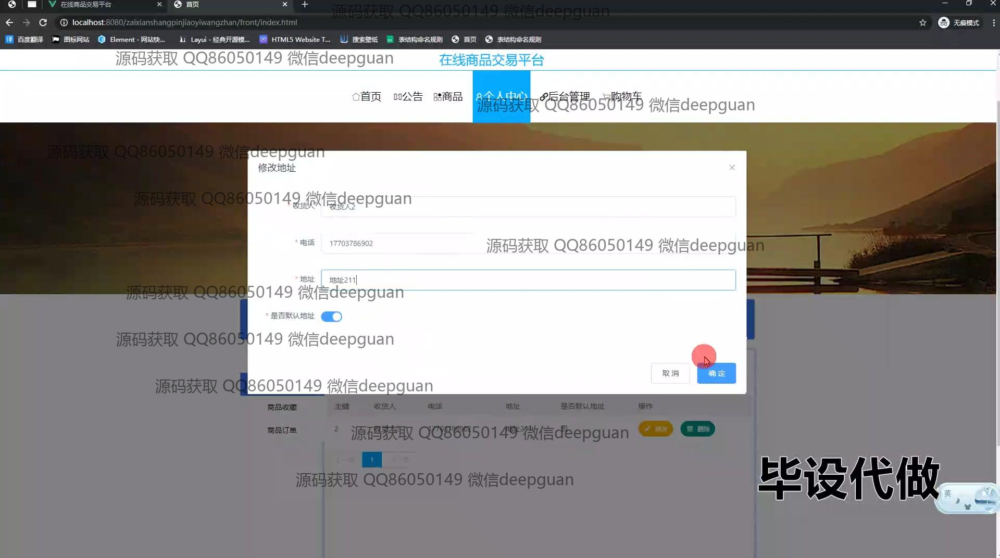
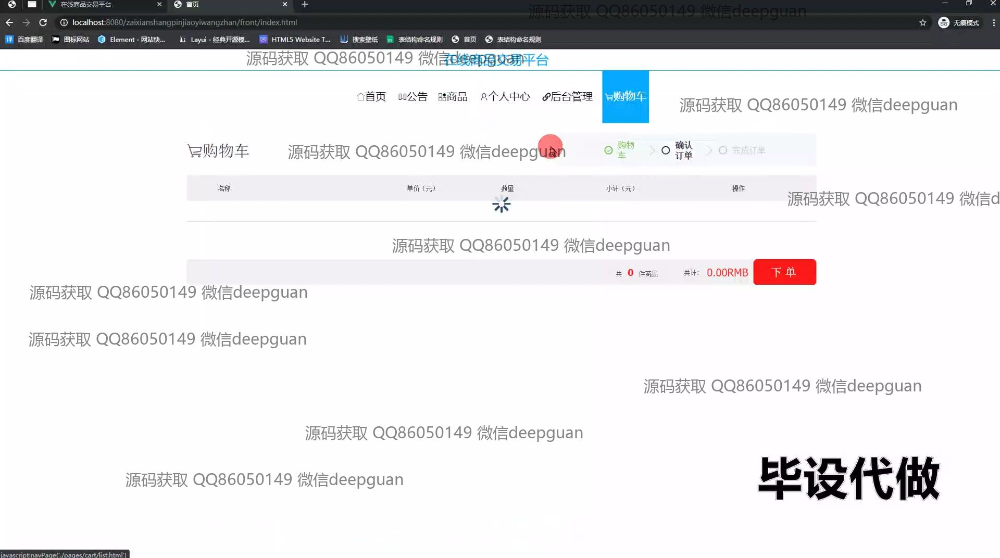
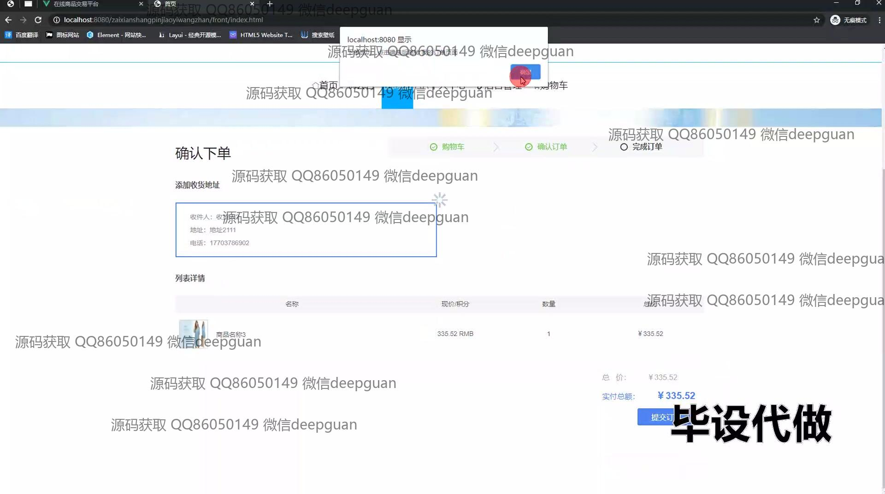
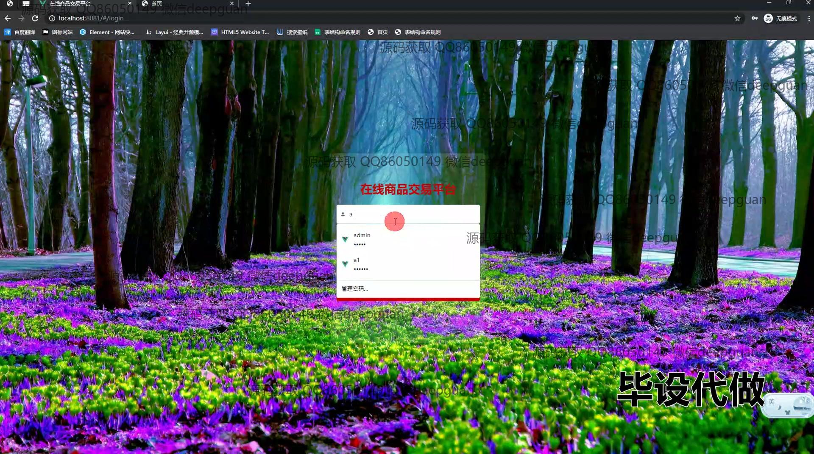
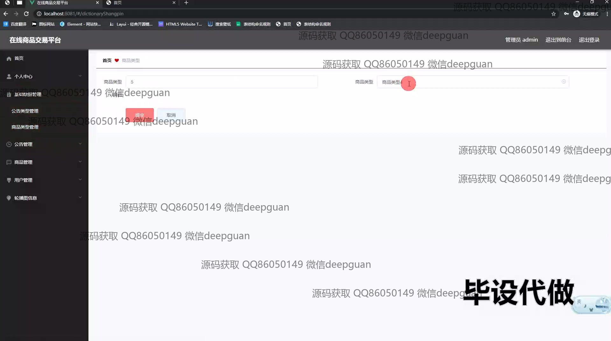
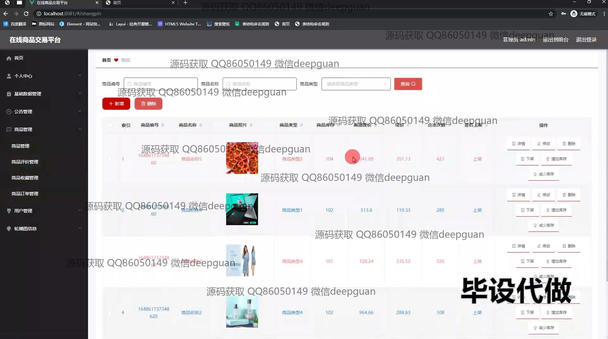
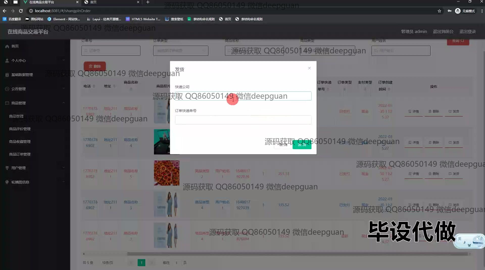
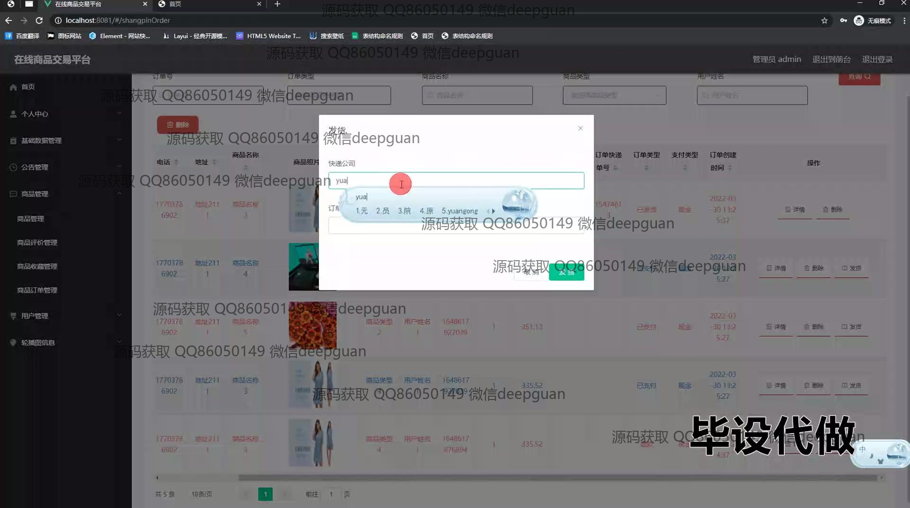
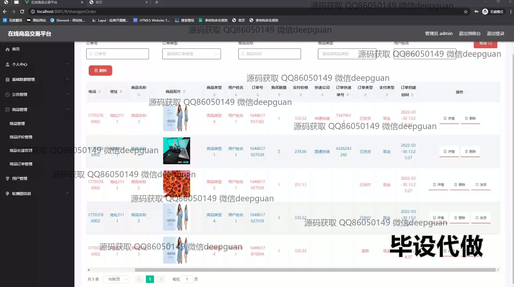
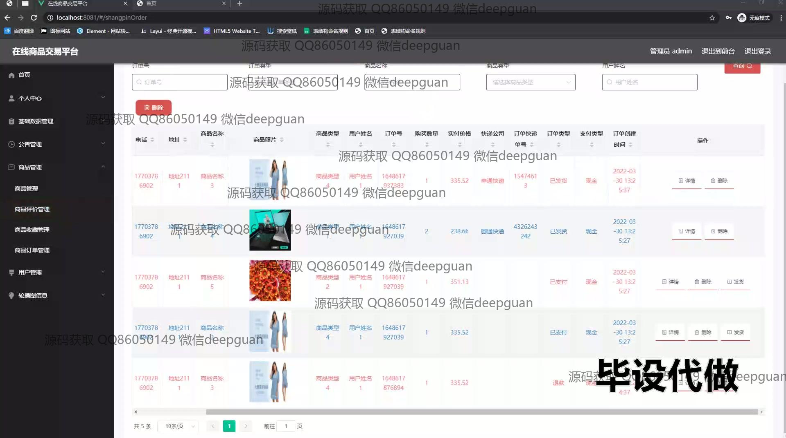
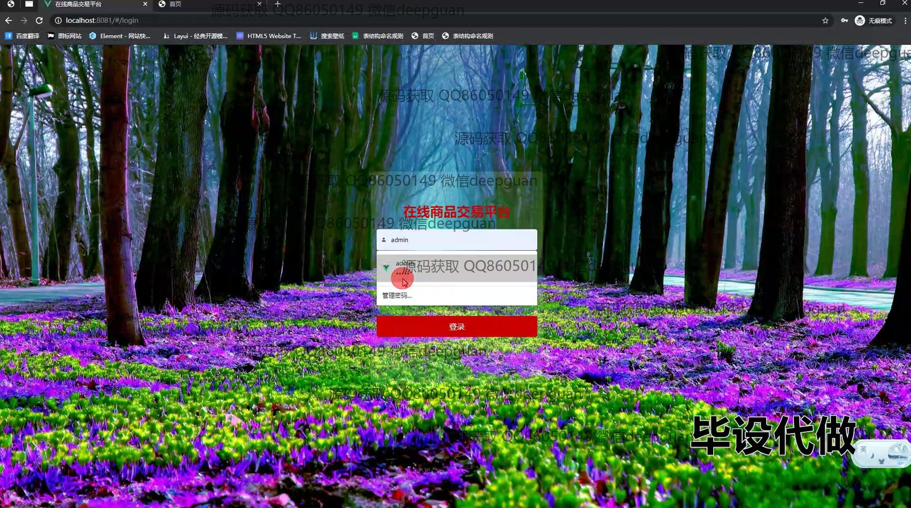
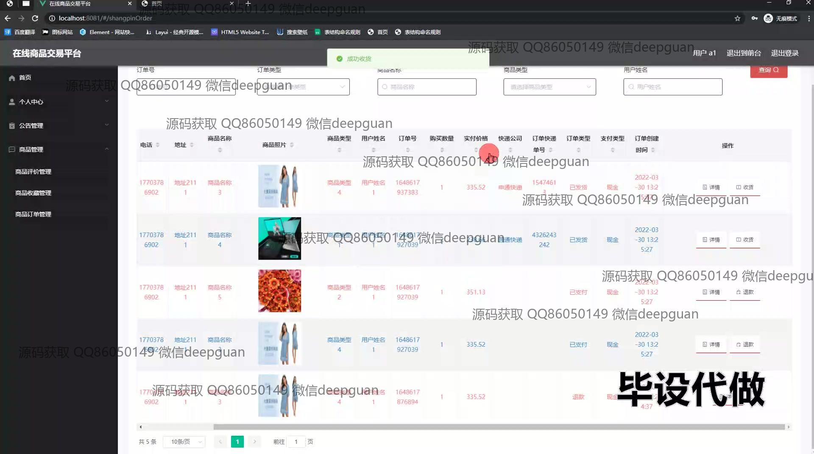
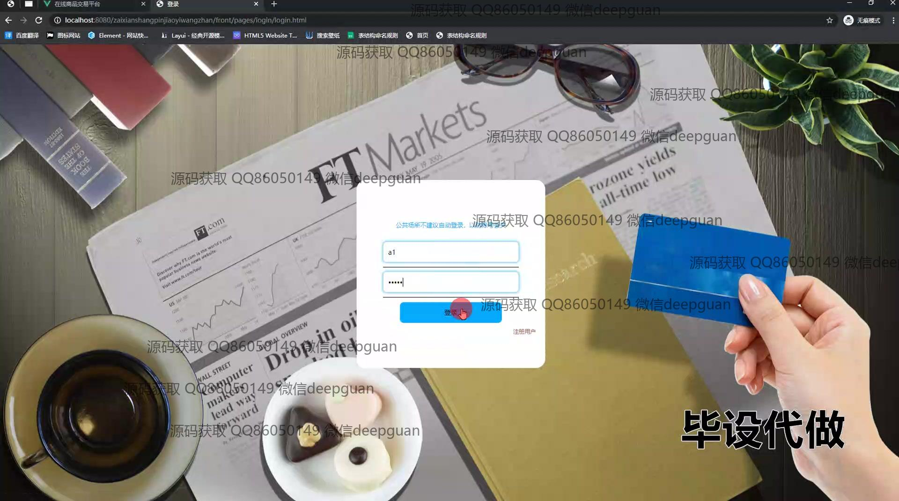
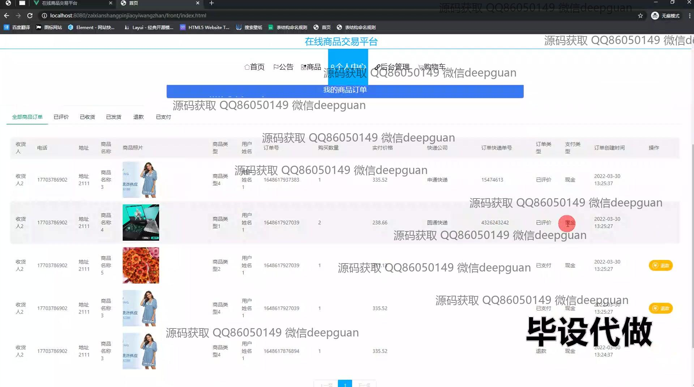
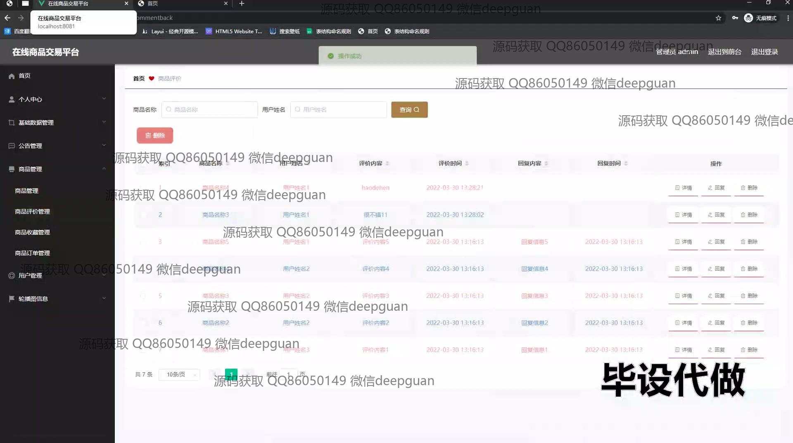

本代码来源于网络,仅供学习参考使用!

